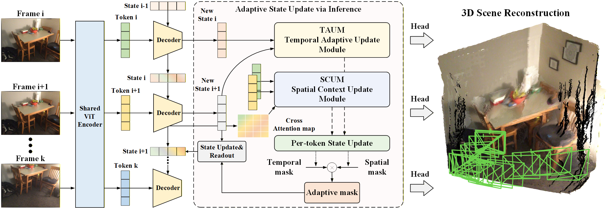
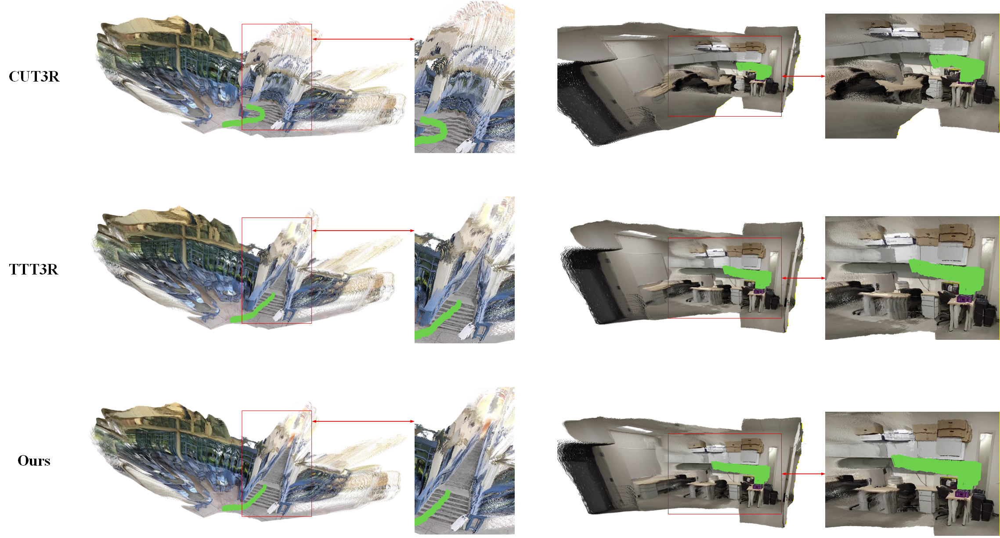

# TTSA3R: Training-Free Temporal-Spatial Adaptive Persistent State for Streaming 3D Reconstruction

<br>
Official implementation of <strong>TTSA3R: Training-Free Temporal-Spatial Adaptive Persistent State for Streaming 3D Reconstruction</strong>

## Framework
<p align="center">  </p>
<!-- Streaming recurrent models enable efficient 3D reconstruction by maintaining persistent state representations. However, they suffer from catastrophic memory forgetting over long sequences due to balancing historical information with new observations. Recent methods alleviate this by deriving adaptive signals from attention perspective, but they operate on single dimensions without considering temporal and spatial consistency. To this end, we propose a training-free framework termed TTSA3R that leverages both temporal state evolution and spatial observation quality for adaptive state updates in 3D reconstruction. In particular, we devise a Temporal Adaptive Update Module that regulates update magnitude by analyzing temporal state evolution patterns. Then, a Spatial Contextual Update Module is introduced to localize spatial regions that require updates through observation-state alignment and scene dynamics. These complementary signals are finally fused to determine the state updating strategies. Extensive experiments demonstrate the effectiveness of TTSA3R in diverse 3D tasks. Moreover, our method exhibits only 15% error increase compared to over 200% degradation in baseline models on extended sequences, significantly improving long-term reconstruction stability. -->

Streaming recurrent models enable efficient 3D reconstruction by maintaining persistent state representations. However, they suffer from catastrophic forgetting over long sequences due to balancing historical information with new observations. Recent methods alleviate this by deriving adaptive signals from attention perspective, but they operate on single dimensions without considering temporal and spatial consistency. To this end, we propose a training-free framework termed TTSA3R that leverages both temporal state evolution and spatial observation quality for adaptive state updates in 3D reconstruction. In particular, we devise a Temporal Adaptive Update Module that regulates update magnitude by analyzing temporal state evolution patterns. Then, a Spatial Contextual Update Module is introduced to localize spatial regions that require updates through observation-state alignment and scene dynamics. These complementary signals are finally fused to determine the state updating strategies. Extensive experiments demonstrate the effectiveness of TTSA3R in diverse 3D tasks. Moreover, our method exhibits only 1.33x error increase compared to over 4x degradation in the baseline model on extended sequences of 3D reconstruction, significantly improving long-term reconstruction stability.

## Demo visualization
<p align="center">  </p>

## Table of Contents
- [Get Started](#getting-started)
  - [Installation](#installation)
  - [Checkpoints](#download-checkpoints)
  - [Inference](#inference)
- [Datasets](#datasets)
- [Evaluation](#evaluation)
  - [Datasets](#datasets-1)
  - [Evaluation Scripts](#evaluation-scripts)
- [Acknowledgements](#acknowledgements)
- [Citation](#citation)

## Getting Started

### Installation

1. Clone TTSA3R.
```bash
git clone https://github.com/anonus2357/ttsa3r.git
cd ttsa3r
```

2. Create the environment.
```bash
conda create -n ttsa3r python=3.12 cmake=3.14.0
conda activate ttsa3r
conda install pytorch==2.4.0 torchvision==0.19.0 pytorch-cuda=12.4 -c pytorch -c nvidia  # use the correct version of cuda for your system
pip install -r requirements.txt
conda install 'llvm-openmp<16'
# for training logging
pip install git+https://github.com/nerfstudio-project/gsplat.git
# for evaluation
pip install evo
pip install open3d
```

3. Compile the cuda kernels for RoPE (as in CroCo v2).
```bash
cd src/croco/models/curope/
python setup.py build_ext --inplace
cd ../../../../
```

### Download Checkpoints

We adopt the pretrained checkpoints provided by CUT3R on Google Drive.
To download the weights, run the following commands:
```bash
cd src
gdown --fuzzy https://drive.google.com/file/d/1Asz-ZB3FfpzZYwunhQvNPZEUA8XUNAYD/view?usp=drive_link
cd ..
```

### Inference
To run the inference code, you can use the following command:
```bash
# the following script will run inference based on TTSA3R and visualize the output with viser on port 8080
python demo.py --model_path MODEL_PATH --seq_path SEQ_PATH --size SIZE --vis_threshold VIS_THRESHOLD --output_dir OUT_DIR  # input can be a folder or a video
# Example:
#     python demo.py --model_path src/cut3r_512_dpt_4_64.pth --size 512 \
#         --seq_path examples/001 --vis_threshold 1.5 --output_dir tmp

# the following script will run inference with global alignment and visualize the output with viser on port 8080
python demo_ga.py --model_path MODEL_PATH --seq_path SEQ_PATH --size SIZE --vis_threshold VIS_THRESHOLD --output_dir OUT_DIR
```
Output results will be saved to `output_dir`.

## Evaluation

### Datasets
Please follow several works [MonST3R](https://github.com/Junyi42/monst3r/blob/main/data/evaluation_script.md) and [Spann3R](https://github.com/HengyiWang/spann3r/blob/main/docs/data_preprocess.md) to prepare **Sintel**, **Bonn**, **KITTI**, **TUM-dynamics**, **ScanNet**, **7scenes** and **Neural-RGBD** datasets.

The datasets should be organized as follows:
```
data/
├── 7scenes
├── bonn
├── kitti
├── neural_rgbd
├── scannetv2
├── sintel
└── tum
```

### Evaluation Scripts
Please refer to the [eval.md](docs/eval.md) for more details.
